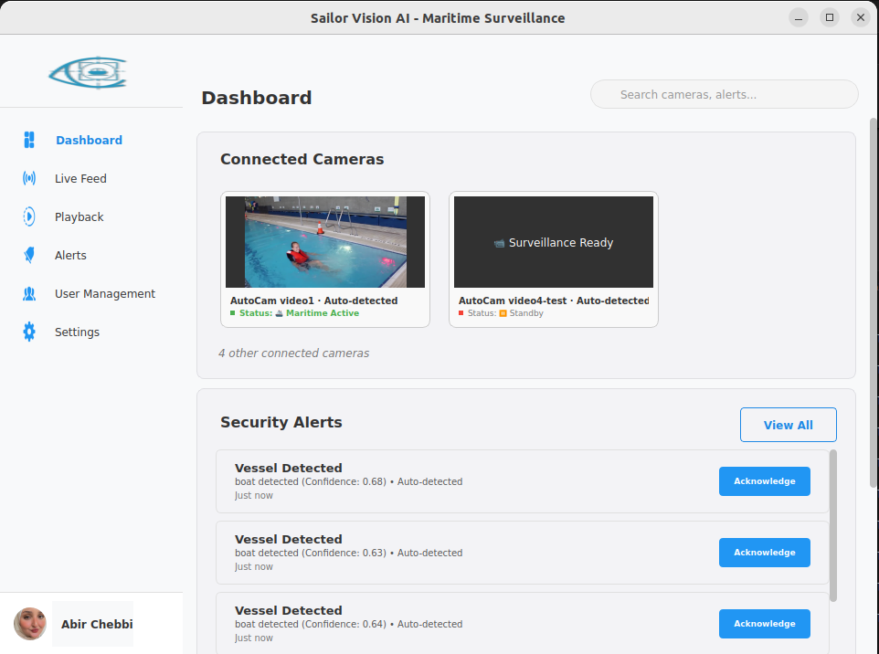
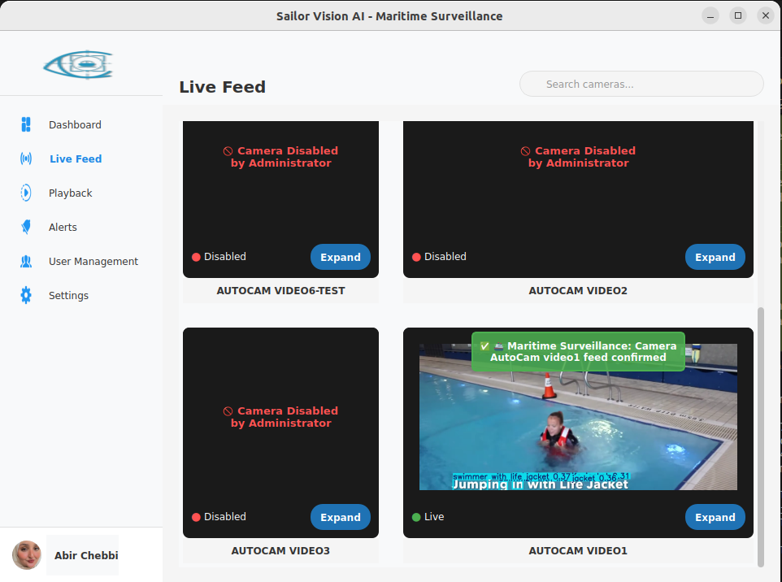
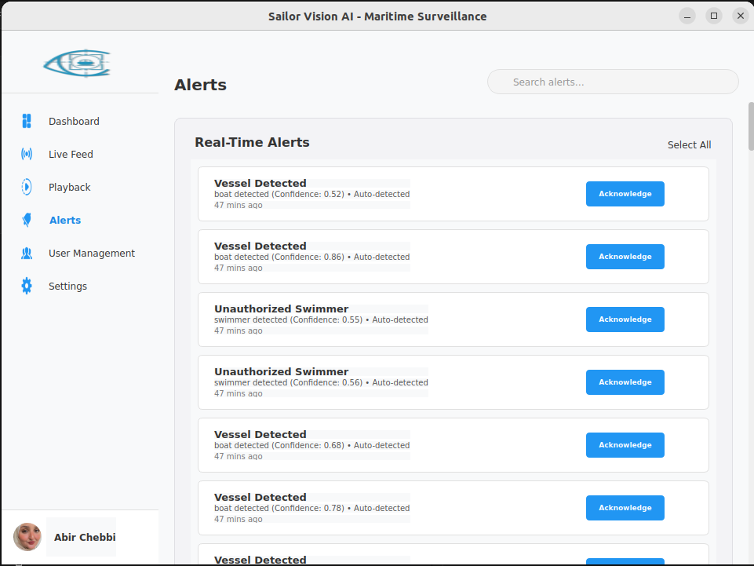
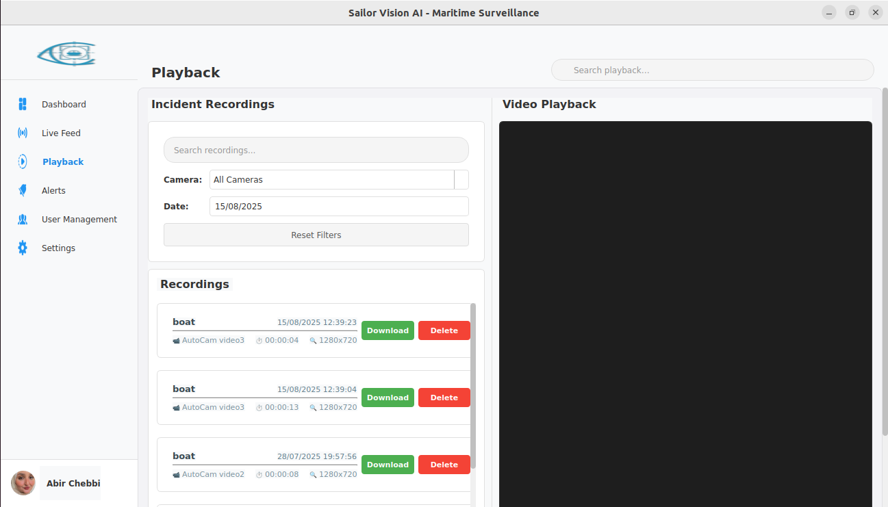
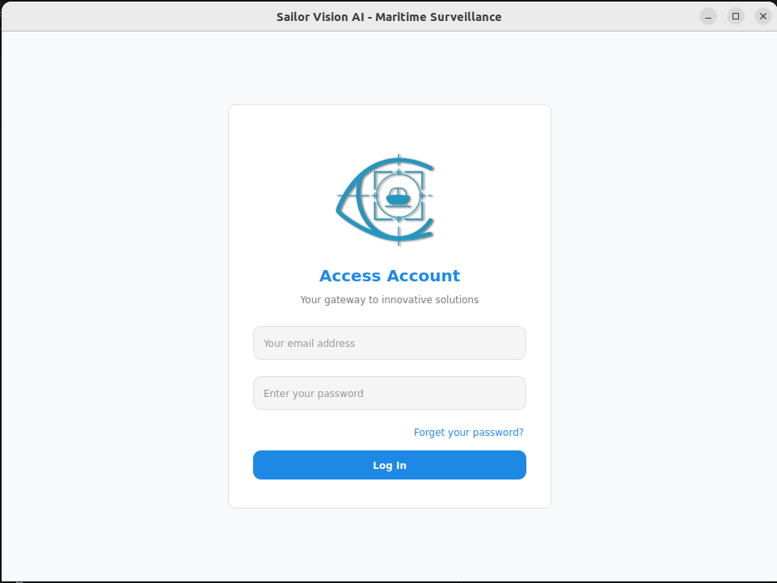

# Sailor Vision AI

<p align="center">
  
</p>

## Project Overview

Sailor Vision AI is an advanced maritime surveillance system designed to enhance safety and situational awareness on water surfaces. The system integrates AI-powered vision modules, real-time object detection, and a desktop GUI for monitoring and managing maritime environments. It leverages **NVIDIA Orin**, **YOLOv8**, and **ROS 2** to provide a scalable and efficient solution for maritime surveillance.

This project is part of the **SailorTech** initiative, which focuses on transforming traditional watercraft into autonomous vessels using cutting-edge technologies like AI, robotics, and edge computing.

---

## System Architecture

The Sailor Vision AI system is composed of the following key components:

### 1. **ROS 2 Maritime Surveillance Modules**
   - **Camera Manager**: Automatically detects and manages connected cameras (e.g., `/dev/video*`) and publishes their list to the `/camera/list` topic with real-time device monitoring.
   - **YOLOv8 Detector**: Performs real-time object detection using trained maritime models and publishes detection results to `/yolo/alerts` with confidence scoring and bounding box information.
   - **ROS Watchdog**: Intelligent monitoring system that tracks camera feed health, implements maritime-aware timeouts, and coordinates with the GUI for seamless status management.
   - **Gazebo Maritime Simulation**: Simulates realistic maritime environments with water planes, boats, swimmers, and life jackets for comprehensive testing and development.

### 2. **PyQt5 Desktop Maritime Surveillance GUI**
   - **Dashboard Screen**: Maritime intelligence with dynamic camera prioritization, real-time status indicators, and security alert management.
   - **Live Feed Screen**: Multi-camera surveillance display with maritime auto-activation, professional status messaging, and click-to-expand functionality.
   - **Settings Screen**: Comprehensive camera management, user administration, pending camera approval workflow, and system configuration.
   - **Alert Management**: Real-time security alert processing, incident tracking, and notification system.
   - **Playback System**: Video recording review with search capabilities, export functionality, and metadata management.
   - **User Management**: Role-based access control with Administrator, Operator, and Viewer permissions.

### 3. **Maritime Database & Backend**
   - **PostgreSQL Database**: Stores camera configurations, user accounts, security alerts, system logs, and recording metadata with full ACID compliance.
   - **SQLAlchemy ORM**: Object-relational mapping with session management, connection pooling, and automatic schema migrations.
   - **User Authentication**: Secure login system with role-based permissions, session management, and password hashing.
   - **Alert Service**: Processes YOLO detections, creates security alerts, and manages incident recording.

### 4. **Virtual Camera & Testing Infrastructure**
   - **v4l2loopback Integration**: Kernel module support for virtual camera simulation and testing.
   - **FFmpeg Video Processing**: Stream processing for virtual cameras and video format conversion.
   - **Detection Recorder**: Automatic video recording triggered by YOLO detections with pre/post-event capture.
   - **Maritime Test Videos**: Curated test footage for system validation and demonstration.

### 5. **AI & Computer Vision Pipeline**
   - **YOLOv8 Maritime Models**: Custom-trained models optimized for SAR (Search and Rescue) missions with swimmer, life jacket, and boat detection.
   - **Real-Time Processing**: GPU-accelerated inference with configurable confidence thresholds and NMS (Non-Maximum Suppression).
   - **Training Infrastructure**: Model training, evaluation, and export scripts with metric tracking and checkpoint management.
   - **Detection Classes**: Swimmer, swimmer with life jacket, life jacket, and boat classifications with confidence scoring.

---

## Features and Functionalities

### Core Features
- **Real-Time Object Detection**: Detects floating objects such as swimmers, life jackets, and boats using YOLOv8.
- **SAR Mission Focus**: The system is designed with Search and Rescue (SAR) missions in mind, focusing on detecting critical objects like swimmers and life jackets. The currently implemented model is optimized for SAR scenarios, with plans to extend coverage to additional maritime objects in future updates.
- **Maritime Surveillance Intelligence**: Professional-grade surveillance system with intelligent auto-activation, dynamic camera prioritization, and maritime-aware status management.
- **Camera Management**: Automatically detects and manages connected cameras with approval workflow.
- **Desktop GUI**: Provides a user-friendly interface for monitoring and managing the system.
- **Simulation Support**: Includes Gazebo simulation for testing in virtual maritime environments.
- **Virtual Camera Integration**: Simulates camera feeds for testing without physical hardware.

### Advanced Maritime Surveillance Features

#### 🚢 **Maritime Auto-Activation System**
- **Intelligent Camera Discovery**: Cameras automatically become active when they start receiving live feed data
- **Security-First Architecture**: Only authorized (active) cameras can display feeds
- **Professional Maritime Messaging**: Context-aware status messages with maritime terminology and emoji indicators
- **Conflict Resolution**: Sophisticated coordination between manual controls and automatic systems

#### 🔧 **ROS Watchdog Integration** 
- **Intelligent Feed Monitoring**: Maritime-aware timeout management with extended grace periods for manually activated cameras
- **Health Monitoring**: Continuous ROS node availability and topic health checking
- **Circuit Breaker Pattern**: Failure detection and recovery mechanisms
- **Coordinated Status Management**: Synchronized updates across all system components

#### 📊 **Dashboard Maritime Intelligence**
- **Dynamic Camera Prioritization**: 3-tier priority system (Critical/Operational/Standby)
- **Real-Time Re-Sorting**: Automatic camera arrangement based on operational status
- **Live Feed Tracking**: Intelligent detection of feed status changes
- **Maritime Status Indicators**: Professional visual indicators with operational context

#### 🔐 **Advanced User Management & Permissions**
- **Role-Based Access Control**: Administrator, Operator, and Viewer roles with granular permissions
- **Adaptive User Interface**: UI components automatically adapt based on user permissions
- **Session Management**: Secure user session handling with permission caching
- **Permission Service**: Centralized permission checking and enforcement

### Additional Functionalities

#### 📹 **Camera Management System**
- **Automatic Camera Detection**: Real-time detection of connected cameras via ROS
- **Pending Camera Workflow**: Admin approval system for newly detected cameras
- **Camera Configuration**: IP address, location, and operational parameter management
- **Status Synchronization**: Real-time status updates across Live Feed, Dashboard, and Settings

#### 🎥 **Live Feed Management**
- **Multi-Camera Grid Display**: Responsive grid layout with real-time video feeds
- **Feed Expansion**: Click-to-expand functionality for detailed camera viewing
- **Maritime Status Messages**: Professional surveillance terminology with contextual styling
- **Feed Security**: Authorization checks to prevent unauthorized feed access

#### 🚨 **Alert & Detection System**
- **Automatic Recording**: Triggered recording when YOLO detections occur
- **Detection Categories**: Swimmer, life jacket, boat, and swimmer with life jacket classifications
- **Alert Management**: Real-time alert processing and database storage
- **Video Recording**: Automatic incident recording with pre/post-event capture

#### 📚 **Playback & Recording Management**
- **Video Playback**: Review recorded surveillance footage
- **Recording Metadata**: Searchable recording database with detection information
- **Export Functionality**: Export recordings for analysis or reporting
- **Storage Management**: Configurable storage settings and cleanup policies

#### ⚙️ **System Settings & Configuration**
- **Profile Management**: User profile editing with photo upload
- **Camera Settings**: Administrative camera configuration and maintenance scheduling
- **System Monitoring**: Real-time system logs and performance metrics
- **Storage Configuration**: Configurable recording storage and retention policies

#### 🔄 **ROS 2 Integration**
- **Modular Architecture**: Scalable ROS 2 node-based communication
- **Topic Management**: Dynamic subscription to camera and YOLO detection topics
- **Real-Time Communication**: Low-latency feed processing and status updates
- **Health Monitoring**: ROS system health checks and automatic recovery

---

## 📸 Screenshots

The Sailor Vision AI system provides an intuitive graphical interface for maritime surveillance operations. Below are screenshots of the main components currently available:

### Dashboard Overview

*Main dashboard with real-time system status, camera connections, and maritime activity overview*

### Live Feed Surveillance

*Real-time camera feeds with YOLOv8 object detection highlighting swimmers, boats, and maritime objects*

### Alert Management

*Alert history with filtering, export capabilities, and detailed incident information*

### Recording Playback

*Recording management with search, playback controls, and incident review capabilities*

### Login Interface

*Secure authentication interface with role-based access control*

### 🚧 Interfaces Under Development

The following interfaces are currently undergoing UI optimization and will be available soon:

- **Settings Configuration**: Advanced system configuration for cameras, detection parameters, storage settings, and maritime zones
- **User Management**: Enhanced role-based access control with user permissions and authentication management

> **Note**: The UI optimization process focuses on improving user experience, performance, and visual consistency across all interfaces. Screenshots will be updated as new interfaces become available.

---

## Component Interaction

### 1. **ROS 2 Maritime Surveillance Pipeline**:
   - The `camera_manager` node continuously monitors for new camera connections and publishes device lists to the `/camera/list` topic.
   - The `yolo_node` subscribes to camera feeds (`/camera/videoX/image_raw`) and performs real-time object detection, publishing annotated results to `/yolo/videoX/image_raw` and alerts to `/yolo/alerts`.
   - The `ros_watchdog` monitors topic activity and camera health, implementing intelligent timeouts and coordinating with the GUI for status management.
   - The `gazebo_sim` module provides a realistic maritime simulation environment with water planes, boats, swimmers, and life jackets for testing.

### 2. **Desktop Maritime Surveillance GUI**:
   - **Real-Time Integration**: Subscribes to ROS topics to display live camera feeds, YOLO detection results, and system health status.
   - **Maritime Auto-Activation**: Automatically activates cameras when feeds are detected, implementing professional surveillance behavior.
   - **Dynamic Prioritization**: Dashboard intelligently sorts cameras based on operational status (Active+Feed > Active > Inactive).
   - **Administrative Control**: Provides comprehensive camera management, user administration, and system configuration through the Settings screen.
   - **Security Alert Processing**: Processes YOLO detection alerts, creates incidents, and triggers automatic video recording.

### 3. **Database & Backend Integration**:
   - **PostgreSQL Backend**: Centralized storage for camera configurations, user accounts, security alerts, and system metadata.
   - **Real-Time Synchronization**: Database changes are immediately propagated across all GUI components using Qt signals.
   - **Session Management**: Secure user authentication with role-based access control and permission enforcement.
   - **Recording Management**: Automatic storage of detection-triggered recordings with searchable metadata.

### 4. **Virtual Camera & Testing Ecosystem**:
   - **v4l2loopback Integration**: Seamlessly simulates camera feeds using `ffmpeg` for comprehensive testing without physical hardware.
   - **Maritime Test Content**: Curated video content featuring swimmers, life jackets, and boats for system validation.
   - **Detection Recording**: Automatic triggering of video recording when maritime incidents are detected by YOLO.

### 5. **Maritime Surveillance Workflow**:
   ```
   Physical Camera → ROS Detection → Admin Approval → Auto-Activation → 
   Live Monitoring → YOLO Detection → Alert Generation → Recording → 
   Incident Review → Export & Analysis
   ```

---

## Installation

### Prerequisites
- **Operating System**: Ubuntu 22.04 or later
- **Python**: Version 3.10 or later
- **ROS 2**: Humble Hawksbill
- **Hardware Requirements**: 
  - NVIDIA GPU (recommended for YOLO inference)
  - Minimum 8GB RAM
  - 50GB free storage for recordings
- **Dependencies**:
  - `PyQt5` - Desktop GUI framework
  - `torch`, `ultralytics` - YOLOv8 object detection
  - `opencv-python` - Computer vision processing
  - `PostgreSQL` - Database backend
  - `SQLAlchemy` - Database ORM
  - `v4l2loopback` - Virtual camera support
  - `ffmpeg` - Video processing
  - `ROS 2 packages` - Camera management and YOLO detection

### Setup Instructions

1. **Clone the Repository**:
   ```bash
   git clone https://github.com/yourusername/sailor-vision-ai.git
   cd sailor-vision-ai
   ```

2. **Set Up a Python Virtual Environment**:
   ```bash
   python3 -m venv venv
   source venv/bin/activate
   ```

3. **Install Python Dependencies**:
   ```bash
   pip install -r requirements.txt
   ```

4. **Install ROS 2 Dependencies**:
   ```bash
   sudo apt update
   sudo apt install ros-humble-desktop python3-colcon-common-extensions
   ```

5. **Build ROS 2 Workspace**:
   ```bash
   cd ros2_ws
   colcon build
   source install/setup.bash
   ```

6. **Install `v4l2loopback`**:
   ```bash
   sudo apt install v4l2loopback-dkms
   ```

7. **Set Up PostgreSQL Database**:
   ```bash
   sudo apt install postgresql postgresql-contrib
   sudo -u postgres createuser --interactive --pwprompt
   sudo -u postgres createdb sailor_vision
   ```

8. **Configure Environment Variables**:
   ```bash
   export PGHOST=localhost
   export PGPORT=5432
   export PGUSER=your_username
   export PGPASSWORD=your_password
   export PGDATABASE=sailor_vision
   export ROS_DISTRO=humble
   ```

---

## Usage

### 1. **Launch the Complete Maritime Surveillance System**
   ```bash
   # Terminal 1: Start ROS 2 surveillance system
   cd ros2_ws
   source install/setup.bash
   ros2 launch camera_manager surveillance.launch.py
   ```

### 2. **Start the Desktop GUI**
   ```bash
   # Terminal 2: Launch the PyQt5 maritime surveillance interface
   cd sailor_vision_gui
   QT_QPA_PLATFORM=xcb python app.py
   ```

### 3. **Access Different GUI Screens**
   - **Dashboard**: Real-time camera overview with maritime intelligence prioritization
   - **Live Feed**: Multi-camera surveillance with auto-activation and professional maritime messaging
   - **Settings**: Camera management, user administration, and system configuration
   - **Alerts**: Security alert management and incident tracking
   - **Playback**: Video recording review and export functionality
   - **User Management**: Role-based access control (Admin only)

### 4. **Maritime Surveillance Workflow**
   1. **Camera Detection**: Physical cameras are automatically detected by ROS
   2. **Admin Approval**: New cameras appear in Settings for administrator approval
   3. **Auto-Activation**: Approved cameras automatically activate when feeds are detected
   4. **Live Monitoring**: Monitor feeds in real-time with YOLO object detection
   5. **Alert Processing**: Automatic recording and alert generation for maritime incidents
   6. **Review & Export**: Access recorded footage through the Playback screen

### 5. **Virtual Camera Testing**
   - **Create a Virtual Camera**:
     ```bash
     sudo modprobe v4l2loopback video_nr=10 card_label="TestCam" exclusive_caps=1
     ls -l /dev/video10
     ```
   - **Feed Maritime Test Video**:
     ```bash
     ffmpeg -re -stream_loop -1 \
       -i "testing_video/maritime_test.mp4" \
       -f v4l2 /dev/video10
     ```
   - **Verify Virtual Feed**:
     ```bash
     ffplay /dev/video10
     ```

### 6. **Gazebo Maritime Simulation**
   ```bash
   # Launch maritime simulation environment
   ros2 launch gazebo_sim maritime_simulation.launch.py
   ```

---

## Environment Variables

### Database Configuration
- `PGHOST`: PostgreSQL server hostname (default: localhost)
- `PGPORT`: PostgreSQL server port (default: 5432)
- `PGUSER`: Database username for the maritime surveillance system
- `PGPASSWORD`: Database password (secure storage recommended)
- `PGDATABASE`: Database name for the sailor vision system
- `DATABASE_URL`: Full PostgreSQL connection URL (alternative to individual variables)

### ROS 2 Configuration
- `ROS_DISTRO`: ROS 2 distribution (set to `humble` for ROS 2 Humble Hawksbill)
- `ROS_DOMAIN_ID`: ROS domain identifier for multi-robot systems (optional)

### Application Configuration
- `QT_QPA_PLATFORM`: Qt platform abstraction (set to `xcb` for Linux desktop)
- `YOLO_MODEL_PATH`: Path to custom YOLOv8 maritime detection model
- `RECORDING_OUTPUT_DIR`: Directory for storing detection-triggered recordings

### Example Configuration
```bash
# Database
export PGHOST=localhost
export PGPORT=5432
export PGUSER=sailor_admin
export PGPASSWORD=secure_password
export PGDATABASE=sailor_vision

# ROS 2
export ROS_DISTRO=humble
export ROS_DOMAIN_ID=0

# Application
export QT_QPA_PLATFORM=xcb
export YOLO_MODEL_PATH=/path/to/maritime_model.pt
export RECORDING_OUTPUT_DIR=/path/to/recordings
```

---

## Database Backend

The maritime surveillance system uses **PostgreSQL** as its primary database backend for:

### Core Data Management
- **User Accounts**: Secure user authentication with role-based permissions (Administrator, Operator, Viewer)
- **Camera Configurations**: Device settings, IP addresses, locations, and operational parameters
- **Security Alerts**: Real-time detection alerts with timestamps, confidence scores, and associated metadata
- **System Logs**: Comprehensive audit trail of system events, user actions, and security incidents

### Advanced Features
- **Session Management**: Secure user session handling with automatic cleanup
- **Recording Metadata**: Searchable database of recorded incidents with detection classifications
- **Permission System**: Granular access control with feature-level permissions
- **System Settings**: Configurable surveillance parameters and operational preferences

### Database Schema Highlights
- **ACID Compliance**: Full transaction support for data integrity
- **Indexing**: Optimized queries for real-time surveillance operations
- **Migrations**: Automatic schema updates using SQLAlchemy migrations
- **Connection Pooling**: Efficient database connection management for high-performance operations

---

## Roadmap

### ✅ **Completed Features**
- [x] **YOLOv8 Maritime Detection**: Custom-trained models for swimmer, life jacket, and boat detection
- [x] **PyQt5 Maritime GUI**: Professional surveillance interface with maritime intelligence
- [x] **ROS 2 Integration**: Modular communication architecture with real-time monitoring
- [x] **Maritime Auto-Activation**: Intelligent camera discovery and activation system
- [x] **ROS Watchdog**: Sophisticated feed monitoring with maritime-aware timeouts
- [x] **Database Backend**: PostgreSQL with SQLAlchemy ORM for comprehensive data management
- [x] **User Management**: Role-based access control with Administrator/Operator/Viewer roles
- [x] **Alert System**: Real-time detection processing with automatic incident recording
- [x] **Gazebo Simulation**: Maritime environment simulation for testing and development

### 🚧 **In Development**
- [ ] **Enhanced Detection Models**: Extended coverage for debris, rescue equipment, and buoys
- [ ] **TensorRT Optimization**: GPU-accelerated YOLO inference for improved performance
- [ ] **Advanced Analytics**: Detection statistics, pattern analysis, and reporting dashboard
- [ ] **Mobile Application**: Remote monitoring capabilities for maritime operators

### 🔮 **Future Enhancements**
- [ ] **Cloud Integration**: Remote monitoring and data synchronization
- [ ] **AI-Powered Analytics**: Predictive analysis for maritime security patterns
- [ ] **Multi-Site Management**: Centralized control for multiple maritime installations
- [ ] **Real-Time Collaboration**: Multi-user coordination for large-scale operations
- [ ] **IoT Integration**: Environmental sensors and weather data integration
- [ ] **Automated Reporting**: Incident reports and compliance documentation
- [ ] **Edge Computing**: Distributed processing for remote maritime installations

### 🌊 **Maritime Environment Deployment**
- [ ] **Harbor Security**: Port and marina surveillance systems
- [ ] **Search & Rescue**: Coast guard and emergency response integration
- [ ] **Environmental Monitoring**: Marine conservation and research applications
- [ ] **Commercial Maritime**: Shipping and offshore platform security

---

## Contributing

We welcome contributions! Please submit a pull request or open an issue for any improvements or bug reports.

---

## License

This project is currently **not licensed**. Please contact the author if you intend to use it for commercial purposes.

---

## Contact

For any inquiries, please contact **Abir Chebbi** via GitHub or email.

---

🚢 **Sailor Vision AI - Enhancing Maritime Surveillance with AI and Computer Vision** 🌊